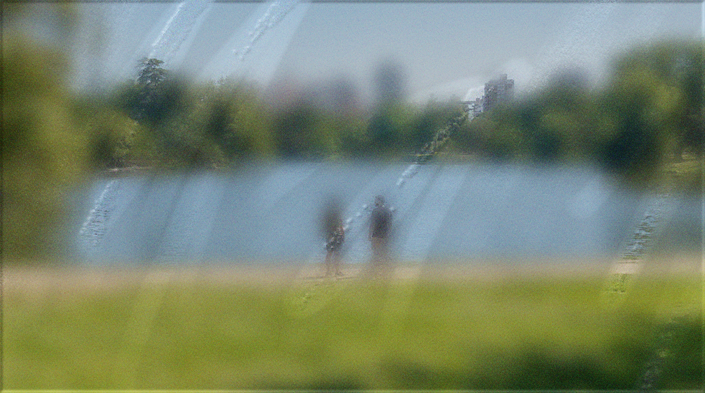

  

  
  
  
  
  

---

<table>
  <tr>
    <td>
      <h2>About me</h2>
      
Mostly okay though it's often nothing.

      
Contributor at <a href="https://github.com/MetrolistGroup/Metrolist"><b>Metrolist</b></a> — a modern YouTube Music client for Android. Mostly through code, reviews, and general project support.

    </td>
    <td width="140" align="center">
      
    </td>
  </tr>
</table>

<table>
  <tr>
    <td width="72" align="center">
      
    </td>
    <td>
      <a href="https://github.com/MetrolistGroup/Metrolist"><b>Metrolist</b></a> 
      A FOSS YouTube Music client for Android 
      
      
      
    </td>
  </tr>
</table>

 

### Last.fm

  

---

### Technologies

  
  
  
  
  
  

---

### Statistics

  

  

  

