  <h1>
    
    adrielGGmotion
  </h1>
  
Small developer • contributor at <a href="https://github.com/MetrolistGroup/Metrolist">Metrolist</a>

  

   

  ## About

  I'm Adriel.

  I contribute to [Metrolist](https://github.com/MetrolistGroup/Metrolist), mostly through commits, pull requests, reviews, and general contribution around the project.

  I'm usually quiet at first, calm in how I work, and more organized in appearance than in reality.

  ### Metrolist

  [Metrolist](https://github.com/MetrolistGroup/Metrolist) is a FOSS Android YouTube Music client and the main place where most of my public work happens.

  I usually contribute through code, reviews, and general project support, with most of my recent Kotlin and Compose work showing up there rather than in personal repositories.

  ## Stack

  <table align="center">
    <tr>
      <td align="center">
        <strong>Mobile / Multiplatform</strong>
         
         
        
        
        
      </td>
    </tr>
    <tr>
      <td align="center">
        <strong>Web / Frontend</strong>
         
         
        
        
        
      </td>
    </tr>
  </table>

  ## Status

  

    
  

  

    
  

  

    
  

